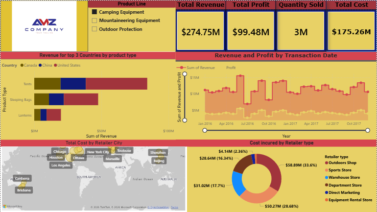

# Adventures-Works-Company-Sales-Dashboard

## Overview

This dashboard provides a comprehensive analysis of sales performance, profitability, product distribution, and retailer cost allocation for the company. It enables business stakeholders to monitor key performance indicators (KPIs), identify top-performing products and regions, and evaluate revenue and profit trends over time.

---

## Dashboard Objectives
* Monitor overall business performance through key financial metrics.
* Analyze revenue contribution by product categories and countries.
* Track revenue and profit trends over time.
* Evaluate retailer-related costs across different retail channels.
* Support data-driven decision-making for sales and operational strategies.

---

## Key Performance Indicators (KPIs)

| Metric            | Value        |
| ----------------- | ------------ |
| **Total Revenue** | **$274.75M** |
| **Total Profit**  | **$99.48M**  |
| **Quantity Sold** | **3M Units** |
| **Total Cost**    | **$175.26M** |

---

## Dashboard Components

### 1. Product Line Filter

Interactive slicer allowing users to filter dashboard results by product category:

* Camping Equipment
* Mountaineering Equipment
* Outdoor Protection

This enables focused analysis on specific product segments.

---

### 2. Revenue by Top 3 Countries and Product Type

**Visualization:** Stacked Horizontal Bar Chart

**Purpose:**
Displays revenue generated by different product types across the top-performing countries:

* Canada
* China
* United States

**Product Types:**

* Tents
* Sleeping Bags
* Lanterns

**Insights:**

* Compare country-wise sales contribution.
* Identify products with the highest revenue generation.
* Understand market demand across regions.

---

### 3. Revenue and Profit by Transaction Date

**Visualization:** Area/Line Combination Chart

**Purpose:**
Tracks revenue and profit performance over time.

**Features:**

* Monthly transaction analysis.
* Revenue trend monitoring.
* Profitability tracking.

**Business Value:**

* Detect seasonal patterns.
* Identify growth periods.
* Monitor business performance fluctuations.

---

### 4. Total Cost by Retailer City

**Visualization:** Geographic Map

**Purpose:**
Displays cost distribution across retailer locations worldwide.

**Example Cities:**

* Chicago
* Houston
* Los Angeles
* Ottawa
* Beijing
* Shenzhen
* Brisbane
* Canberra

**Insights:**

* Understand geographic cost concentration.
* Analyze operational spending by location.
* Support regional optimization strategies.

---

### 5. Cost Incurred by Retailer Type

**Visualization:** Donut Chart

**Purpose:**
Breaks down total costs by retailer channel.

**Retailer Types:**

* Outdoor Shop
* Sports Store
* Warehouse Store
* Department Store
* Direct Marketing
* Equipment Rental Store

**Insights:**

* Determine cost-heavy sales channels.
* Evaluate channel efficiency.
* Optimize retailer partnerships.

---

## Business Insights

### Revenue Performance

* Generated **$274.75M** in total revenue.
* Achieved **$99.48M** in profit, indicating strong profitability.
* Sold approximately **3 million units** across product categories.

### Product Performance

* Tents contribute the highest revenue among displayed product types.
* The United States appears to be the strongest revenue-generating market.

### Retailer Analysis

* Outdoor Shops and Equipment Rental Stores account for a significant share of retailer-related costs.
* Direct Marketing contributes the smallest portion of total costs.

### Geographic Distribution

* Costs are spread across multiple international retailer locations, highlighting a global sales footprint.

---

## Technologies Used

* **Power BI Desktop**
* Power Query (ETL)
* DAX (Data Analysis Expressions)
* Interactive Visualizations
* Geographic Mapping

---

## Recommended Use Cases

* Executive performance reporting
* Sales trend monitoring
* Product portfolio analysis
* Retail channel optimization
* Regional performance evaluation
* Profitability assessment

---

## Future Enhancements

* Customer segmentation analysis
* Forecasting and predictive analytics
* Year-over-Year (YoY) growth metrics
* Profit margin analysis by product line
* Drill-through pages for detailed transaction insights
* Dynamic benchmarking against targets

---

## Dashboard Snapshot

The dashboard offers a consolidated view of company performance by combining financial KPIs, product analysis, geographical insights, and retailer cost distribution into a single interactive reporting solution, helping stakeholders make informed strategic decisions.
